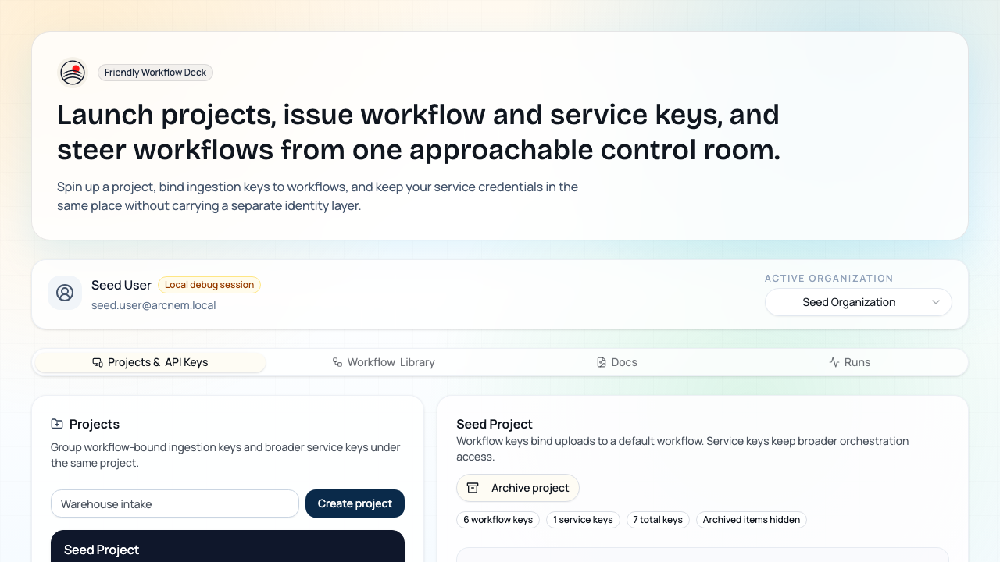
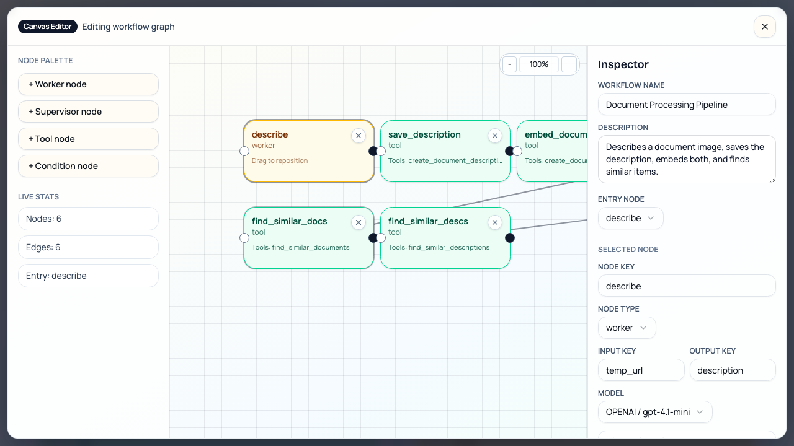
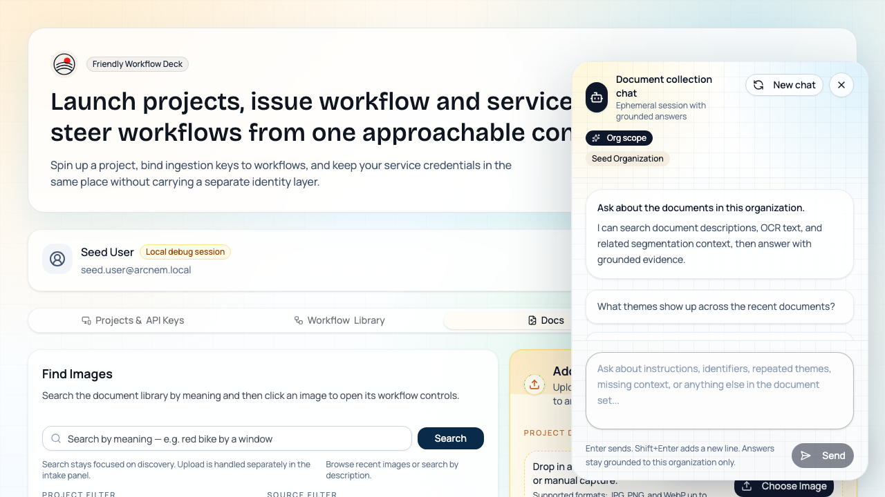
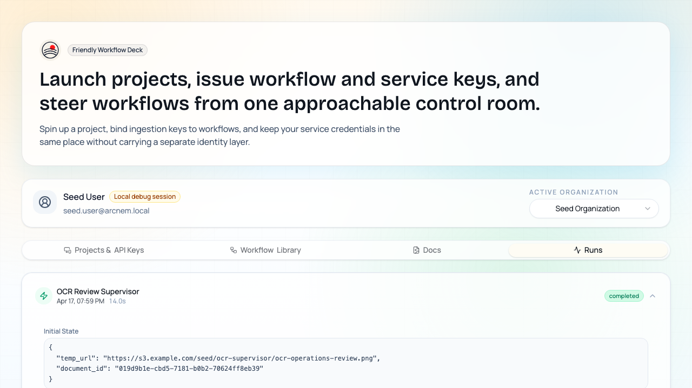
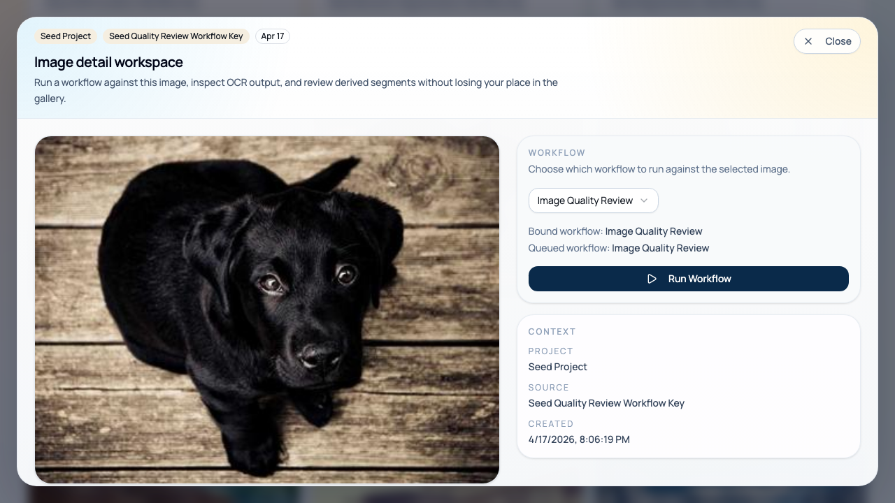
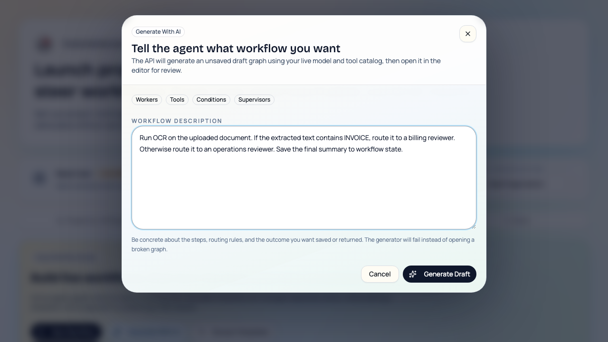

<p align="center">
  
</p>

<h1 align="center">Arcnem Vision</h1>

<p align="center">
  <strong>機械に「見る」を教え、エージェントに「次の判断」を任せる。</strong>
</p>

<p align="center">
  <a href="README.md">English</a> ·
  <a href="#クイックスタート">クイックスタート</a> ·
  <a href="#アーキテクチャ">アーキテクチャ</a> ·
  <a href="site/">ドキュメントサイト</a>
</p>

---

Arcnem Visionは、画像を受け取り、設定可能なAIワークフローで処理し、その結果と実行履歴を運用画面で扱えるオープンソースの画像解析基盤です。ワークフローAPIキーは組織/プロジェクト単位で画像を送信でき、運用担当者はダッシュボードから単発アップロードして任意のワークフローを流せます。どちらの経路でも、最終的にはPostgres上に保存されたエージェントグラフが読み込まれ、Goのサービスが実行を担います。

このリポジトリで本当に重要なのはサーバー側の仕組みです。Flutterアプリは撮影やGenUIの実験に便利なデモクライアントですが、主役ではありません。価値の中心にあるのは、ワークフロー定義、ワークフローキーへの割り当て、OCR・説明文・埋め込み・セグメンテーションの保存、そして各ステップの状態変化まで追える運用基盤です。

## コアとなる機能

- **取り込み経路は2つ**: ワークフローAPIキー経由の自動処理と、ダッシュボードからの単発アップロードに対応
- **ワークフローはデータとして管理**: グラフはデータベースに保存され、作成・編集・テンプレート化・複製・割り当てを再デプロイなしで行える
- **解析方法を組み合わせられる**: OCR、説明文生成、画像埋め込み、説明文埋め込み、プロンプト駆動セグメンテーション、セマンティックセグメンテーション、類似検索、根拠付きコレクションチャット
- **オーケストレーションを混在できる**: LLMワーカー、MCPツールノード、supervisor、conditionを同じグラフに混ぜて構成できる
- **実行履歴を細かく追える**: `agent_graph_runs` と `agent_graph_run_steps` に初期状態、最終状態、各ステップの差分、所要時間、エラーを保存
- **運用の中心はダッシュボード**: プロジェクト、ワークフローキー、サービスキー、ワークフロー、アップロード、検索、チャット、実行状況を1つの画面で扱える

## どこを自由に変えられるか

- **workerノード**: モデル、プロンプト、入力モード、利用ツールを選べる
- **toolノード**: 1つのMCPツールを入出力マッピング付きで呼び出せる
- **supervisorノード**: 担当ワーカー、反復回数の上限、終了先を設定できる
- **conditionノード**: `contains` / `equals` で状態を判定し、分岐先を明示できる
- **state reducer**: キーごとに追記するか上書きするかを制御できる
- **テンプレートライブラリ**: 再利用可能な版付きワークフローを保存し、ダッシュボードから編集可能なコピーを起動できる
- **AIによるワークフロー下書き生成**: やりたい処理を自然文で書くと、ライブのモデル/ツールカタログを使った未保存のグラフ下書きから始められる

## 想定している解析パターン

シードには、次のようなワークフローが入っています。

- **`Document Processing Pipeline`**: 画像を説明し、その説明を保存し、画像と説明文の両方を埋め込み、類似項目を探す
- **`Image Quality Review`**: supervisorが画像品質を見て、良好担当か不良担当に振り分ける
- **`Document Segmentation Showcase`**: 画像から短いセグメンテーション用プロンプトを作り、セグメント結果を要約する
- **`Semantic Document Segmentation Showcase`**: セマンティックセグメンテーションを直接実行し、その結果を説明する
- **`OCR Keyword Condition Router`**: OCR抽出後、キーワードで決定論的に分岐して要約を保存する
- **`OCR Review Supervisor`**: 信頼度付きOCRを取り、専門ワーカーに振り分けてレビュー結果を保存する

これらを支えるMCP層では、説明文生成、画像埋め込み、OCR、セグメンテーション、説明文埋め込み、類似検索、範囲を絞った検索・一覧取得、文脈付きドキュメント取得を提供しています。

## 技術スタック

| レイヤー | 技術 | 役割 |
| --- | --- | --- |
| **API** | Bun, Hono, better-auth, Inngest, Pino | 署名付きアップロード、認証、実行トリガー、リアルタイム通知 |
| **ダッシュボード** | React 19, TanStack Router, Tailwind, shadcn/ui | プロジェクト/ワークフローキー/サービスキー管理、ワークフロー編集、AI下書き生成、ドキュメント閲覧、検索、チャット、実行確認 |
| **エージェント** | Go, Gin, LangGraph, LangChain, inngestgo | DBからグラフを読み込み、worker/tool/supervisor/conditionを実行 |
| **MCP** | Go, MCP go-sdk, replicate-go, GORM | OCR、説明文生成、埋め込み、セグメンテーション、取得系ツール |
| **ストレージ** | Postgres 18 + pgvector, S3互換ストレージ, Redis | ドキュメント、派生データ、ベクター検索、セッション、リアルタイム配信 |
| **クライアント** | Flutter, Dart, flutter_gemma, GenUI | 撮影、プレビュー、GenUI実験用のデモクライアント |

## アーキテクチャ

```text
┌──────────────────────┐          ┌──────────────────────────┐
│ Device / Integration │──x-api-key upload flow────────────▶│
└──────────────────────┘          │        Hono API          │
                                  │   presign / ack / auth   │
┌──────────────────────┐          │                          │
│ Dashboard Operators  │──session-based uploads / queue────▶│
└──────────┬───────────┘          └─────────────┬────────────┘
           │                                    │
           │ search, chat, runs, config         │ enqueue
           ▼                                    ▼
     ┌──────────────┐                    ┌──────────────┐
     │  Dashboard   │◀──realtime SSE────▶│    Inngest    │
     │  Control UI  │                    └──────┬───────┘
     └──────┬───────┘                           │
            │                                    ▼
            │                            ┌──────────────┐
            └──────────────▶ Postgres ◀──│  Go Agents    │
                           + pgvector    │  LangGraph    │
                                         └──────┬───────┘
                                                │
                                                ▼
                                         ┌──────────────┐
                                         │  MCP Server   │
                                         │ OCR / desc /  │
                                         │ embed / seg / │
                                         │ retrieval     │
                                         └──────────────┘
```

**ワークフローキー経路**: ワークフローキーのクライアントや外部連携先が `/api/uploads/presign` を呼び、S3へ直接アップロードし、最後に `/api/uploads/ack` を呼びます。APIはオブジェクトを検証してドキュメントを作成し、`document/process.upload` を発火します。その後、エージェントサービスがそのキーに紐づくデフォルトワークフローを読み込んで実行します。

**ダッシュボード経路**: 運用担当者はDocsタブから画像をプロジェクトにアップロードできます。この経路では、まずワークフローキーに紐付かないドキュメントを作り、その後で保存済みワークフローを任意に投入します。

**実行経路**: エージェントサービスがDBのグラフ定義からLangGraphを組み立て、必要に応じてMCPツールを呼び出し、OCR、説明文、埋め込み、セグメンテーション、実行ログをPostgresに保存します。

## スクリーンショット

| プロジェクトとAPIキー | グラフ編集ペイン |
|---|---|
|  |  |

| Docs検索とコレクションチャット | 実行の詳細 |
|---|---|
|  |  |

| 画像詳細ワークスペース | AIワークフロー下書き |
|---|---|
|  |  |

## クイックスタート

### 1. クローンと設定

```bash
git clone https://github.com/arcnem-ai/arcnem-vision.git
cd arcnem-vision
```

すべての `.env.example` を `.env` にコピーします。

```bash
cp server/packages/api/.env.example server/packages/api/.env
cp server/packages/db/.env.example  server/packages/db/.env
cp server/packages/dashboard/.env.example server/packages/dashboard/.env
cp models/agents/.env.example       models/agents/.env
cp models/mcp/.env.example          models/mcp/.env
cp client/.env.example              client/.env
```

必要な外部サービスのキーは次の2つです。

- **[OpenAI APIキー](https://platform.openai.com/api-keys)** → `models/agents/.env` の `OPENAI_API_KEY`
- **同じOpenAIキーを使う場合（推奨）** → ダッシュボードのコレクションチャットとAIワークフロー下書き生成用に `server/packages/api/.env` の `OPENAI_API_KEY`
- **[Replicate APIトークン](https://replicate.com/account/api-tokens)** → `models/mcp/.env` の `REPLICATE_API_TOKEN`

それ以外はローカル開発向けに初期設定済みです。Postgres、Redis、MinIO は `docker-compose.yaml` 側で起動します。

### 2. スタックを起動

```bash
tilt up
```

Tiltは、API、ダッシュボード、エージェント、MCP、Inngest、ドキュメントサイト、Flutterデモクライアントまでまとめて立ち上げます。コア機能を確認したい場合は、まず `http://localhost:3001` のダッシュボードを見るのがおすすめです。

### 3. データベースをシード

Tilt UI で **seed-database** を実行します。

シードでは次のものが用意されます。

- デモ用の組織、プロジェクト、ワークフローキー、サービスキー、APIキー
- 編集可能なワークフローと再利用用テンプレート
- 説明文生成、OCR、品質判定、セグメンテーション向けのサンプル画像
- OCR結果、説明文、埋め込み、セグメンテーション、実行履歴のサンプル
- ローカル開発用のダッシュボードセッション

`server/packages/api/.env.example` では `API_DEBUG=true` が有効なので、シード後はダッシュボードがローカル用セッションに自動で入れる状態になります。

### 4. コア機能を順に見る

1. `http://localhost:3001` を開く
2. **Projects & API Keys** でシード済みワークフローキー、サービスキー、割り当て済みワークフローを確認する
3. **Workflow Library** でテンプレートを見たり、**Generate With AI** から下書きを作ったり、グラフ構成を確認する
4. **Docs** でシード済みドキュメントを見るか、ダッシュボードから新しい画像をアップロードする
5. **Runs** で初期状態、各ステップ差分、最終状態、エラーを確認する

### 5. ワークフローキー経路の自動処理を試す

ワークフローAPIキーを使うと、自動処理の流れを確認できます。

```bash
# 1. 署名付きアップロードURLを取得
curl -X POST http://localhost:3000/api/uploads/presign \
  -H "Content-Type: application/json" \
  -H "x-api-key: ${API_KEY}" \
  -d '{"contentType":"image/png","size":12345}'

# 2. ストレージへ直接アップロード
curl -X PUT "${UPLOAD_URL}" --data-binary @photo.png

# 3. アップロードを確定
curl -X POST http://localhost:3000/api/uploads/ack \
  -H "Content-Type: application/json" \
  -H "x-api-key: ${API_KEY}" \
  -d '{"objectKey":"uploads/.../photo.png"}'
```

ワークフローキーに紐づいたアップロードでは、3番目の `ack` でドキュメントが作成され、そのキーに設定されたワークフローが `document/process.upload` 経由で実行されます。

## 必要条件

- Docker + Docker Compose
- Bun
- Go 1.25+
- CompileDaemon（`go install github.com/githubnemo/CompileDaemon@latest`）
- Flutter SDK
- Tilt

## リポジトリ構成

```text
arcnem-vision/
├── server/                 Bunワークスペース
│   ├── packages/api/       アップロード/認証ルート、ダッシュボードAPI、Inngest連携
│   ├── packages/db/        Drizzleスキーマ、マイグレーション、シード、テンプレート
│   ├── packages/dashboard/ 運用用Reactダッシュボード
│   └── packages/shared/    共通Envヘルパー
├── models/                 Goワークスペース
│   ├── agents/             ワークフロー読み込み、LangGraph実行、run tracker
│   ├── mcp/                OCR・埋め込み・説明文・セグメンテーション・取得系ツール
│   ├── db/                 GORMモデル生成
│   └── shared/             S3やリアルタイム配信の共通処理
└── client/                 Flutterデモクライアント
```

## ドキュメント

| ドキュメント | 内容 |
| --- | --- |
| [site/](site/) | オンボーディング、アーキテクチャ、ガイド、API例をまとめたドキュメントサイト |
| [site/src/content/docs/ja/architecture.md](site/src/content/docs/ja/architecture.md) | 取り込み経路、ワークフロー、保存データ、実行追跡の全体像 |
| [site/src/content/docs/ja/guides/dashboard-workflow-editor.md](site/src/content/docs/ja/guides/dashboard-workflow-editor.md) | ダッシュボード運用、ワークフロー編集、Docsタブ、Runsタブ |
| [site/src/content/docs/ja/reference/api.md](site/src/content/docs/ja/reference/api.md) | ワークフローキー経路、ダッシュボードアップロード、ワークフロー投入、リアルタイムAPI |

## コントリビューション

[CONTRIBUTING.md](CONTRIBUTING.md) にコントリビューション手順があります。AIコーディングエージェントを使う場合は [AGENTS.md](AGENTS.md) も参照してください。

---

<p align="center">
  東京の<a href="https://arcnem.ai">Arcnem AI</a>が開発。
</p>
