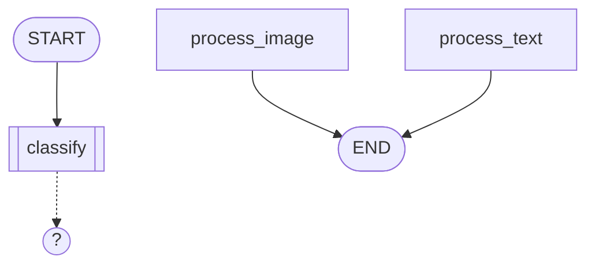

# LangGraphGo in Arcnem Vision

How `github.com/smallnest/langgraphgo` (v0.8.5) fits into the arcnem-vision Go services -- the graph execution engine that orchestrates agent workflows for document processing.

Requires Go 1.25+. Depends on `github.com/tmc/langchaingo` for LLM and tool interfaces (see [`docs/langchaingo.md`](langchaingo.md)).

## Where It Fits

| Service | What langgraphgo does there |
|---------|----------------------------|
| `models/agents` | Builds and executes agent workflow graphs loaded from the database. Inngest triggers the job; langgraphgo runs the graph. |
| Future | Streaming execution results back to clients. Multi-agent supervisor patterns. Human-in-the-loop approval flows. |

`models/agents/go.mod` already depends on `github.com/smallnest/langgraphgo v0.8.5`.

**What langgraphgo does NOT cover**: Event scheduling and durable execution (that's Inngest), LLM calls and tool interfaces (that's langchaingo), or database access (that's GORM).

---

## Core Concepts

LangGraphGo models workflows as directed graphs where **state** flows through **nodes** connected by **edges**.

```
START ──> [node_a] ──> [node_b] ──?──> [node_c] ──> END
                                  └──> [node_d] ──> END
```

| Concept | What it is |
|---------|-----------|
| **StateGraph[S]** | The graph definition. `S` is your state type (struct or `map[string]any`). |
| **Node** | A function `func(ctx, state S) (S, error)` that transforms state. |
| **Edge** | A static connection from one node to another. |
| **Conditional Edge** | A dynamic connection where a function inspects state and returns the next node name. |
| **END** | Special constant (`graph.END`). An edge to END terminates the graph. |
| **StateRunnable[S]** | The compiled graph. Call `.Invoke(ctx, state)` to execute. |
| **Schema** | Defines how node outputs merge into the running state (reducers). |
| **Command** | Returned by a node to dynamically override the next node (bypass edges). |

---

## Installation

```bash
go get github.com/smallnest/langgraphgo@v0.8.5
```

Key imports:

```go
import (
    "github.com/smallnest/langgraphgo/graph"
    "github.com/smallnest/langgraphgo/prebuilt"
    "github.com/smallnest/langgraphgo/adapter/mcp"
    "github.com/smallnest/langgraphgo/store"
)
```

---

## Building Graphs

### Basic: Untyped State (`map[string]any`)

The simplest approach. Flexible but requires type assertions.

```go
g := graph.NewStateGraph[map[string]any]()

g.AddNode("describe", "Generate image description", func(ctx context.Context, state map[string]any) (map[string]any, error) {
    objectKey := state["object_key"].(string)
    description, err := describeImage(ctx, objectKey)
    if err != nil {
        return nil, err
    }
    state["description"] = description
    return state, nil
})

g.AddNode("embed", "Create embedding from description", func(ctx context.Context, state map[string]any) (map[string]any, error) {
    description := state["description"].(string)
    vec, err := embedder.EmbedQuery(ctx, description)
    if err != nil {
        return nil, err
    }
    state["embedding"] = vec
    return state, nil
})

g.SetEntryPoint("describe")
g.AddEdge("describe", "embed")
g.AddEdge("embed", graph.END)

runnable, err := g.Compile()
if err != nil {
    return err
}

result, err := runnable.Invoke(ctx, map[string]any{
    "object_key": "uploads/abc123.jpg",
})
// result["description"] and result["embedding"] are populated
```

### Typed State (Recommended for New Code)

Use a struct for compile-time safety. No type assertions needed.

```go
type ProcessingState struct {
    ObjectKey   string    `json:"object_key"`
    Description string    `json:"description"`
    Embedding   []float32 `json:"embedding"`
    DocumentID  string    `json:"document_id"`
}

g := graph.NewStateGraph[ProcessingState]()

g.AddNode("describe", "Generate image description", func(ctx context.Context, state ProcessingState) (ProcessingState, error) {
    description, err := describeImage(ctx, state.ObjectKey)
    if err != nil {
        return state, err
    }
    state.Description = description
    return state, nil
})

g.AddNode("embed", "Create embedding", func(ctx context.Context, state ProcessingState) (ProcessingState, error) {
    vec, err := embedder.EmbedQuery(ctx, state.Description)
    if err != nil {
        return state, err
    }
    state.Embedding = vec
    return state, nil
})

g.SetEntryPoint("describe")
g.AddEdge("describe", "embed")
g.AddEdge("embed", graph.END)

runnable, _ := g.Compile()
result, _ := runnable.Invoke(ctx, ProcessingState{
    ObjectKey:  "uploads/abc123.jpg",
    DocumentID: "doc-uuid",
})
// result.Description and result.Embedding are populated -- fully typed
```

---

## Conditional Routing

Conditional edges let the graph branch based on state. The condition function inspects the current state and returns the name of the next node.

```go
g.AddNode("classify", "Classify document type", func(ctx context.Context, state map[string]any) (map[string]any, error) {
    docType, _ := classifyDocument(ctx, state["object_key"].(string))
    state["doc_type"] = docType
    return state, nil
})

g.AddNode("process_image", "Process as image", processImageFn)
g.AddNode("process_pdf", "Process as PDF", processPDFFn)
g.AddNode("process_text", "Process as text", processTextFn)

g.SetEntryPoint("classify")
g.AddConditionalEdge("classify", func(ctx context.Context, state map[string]any) string {
    switch state["doc_type"].(string) {
    case "image":
        return "process_image"
    case "pdf":
        return "process_pdf"
    default:
        return "process_text"
    }
})

g.AddEdge("process_image", graph.END)
g.AddEdge("process_pdf", graph.END)
g.AddEdge("process_text", graph.END)
```

With typed state:

```go
g.AddConditionalEdge("classify", func(ctx context.Context, state ProcessingState) string {
    if state.DocType == "image" {
        return "process_image"
    }
    return "process_text"
})
```

---

## Parallel Execution

When multiple edges fan out from a single node, the targets run in parallel automatically. Results are merged back into state.

```go
// Fan-out: both "ocr" and "caption" run concurrently after "load"
g.AddEdge("load", "ocr")
g.AddEdge("load", "caption")

// Fan-in: both converge to "combine"
g.AddEdge("ocr", "combine")
g.AddEdge("caption", "combine")

g.AddEdge("combine", graph.END)
```

When nodes run in parallel and both modify state, the last result wins by default. Use a **state merger** or **schema with reducers** for smarter merging.

### State Merger

```go
g.SetStateMerger(func(ctx context.Context, current map[string]any, results []map[string]any) (map[string]any, error) {
    merged := make(map[string]any)
    for k, v := range current {
        merged[k] = v
    }
    for _, r := range results {
        for k, v := range r {
            merged[k] = v
        }
    }
    return merged, nil
})
```

---

## State Schemas and Reducers

Schemas define how node outputs merge into the running state. Without a schema, each node's full output replaces the state.

### MapSchema (for `map[string]any` state)

```go
schema := graph.NewMapSchema()

// "messages" key appends instead of overwriting
schema.RegisterReducer("messages", graph.AppendReducer)

// "status" key always overwrites (default behavior, but explicit)
schema.RegisterReducer("status", graph.OverwriteReducer)

g.SetSchema(schema)
```

Built-in reducers:

| Reducer | Behavior |
|---------|----------|
| `graph.OverwriteReducer` | New value replaces old (default for unregistered keys) |
| `graph.AppendReducer` | Appends to slice (or creates a new slice) |
| `graph.AddMessages` | Appends messages with ID-based upsert support |

### StructSchema (for typed state)

```go
schema := graph.NewStructSchema(
    ProcessingState{}, // initial value
    func(current, new ProcessingState) (ProcessingState, error) {
        // Custom merge: only overwrite non-zero fields
        if new.Description != "" {
            current.Description = new.Description
        }
        if len(new.Embedding) > 0 {
            current.Embedding = new.Embedding
        }
        return current, nil
    },
)

g.SetSchema(schema)
```

If you pass `nil` as the merge function, `DefaultStructMerge` is used -- it overwrites non-zero fields via reflection.

### FieldMerger (fine-grained struct merging)

```go
fm := graph.NewFieldMerger(ProcessingState{})
fm.RegisterFieldMerge("Logs", graph.AppendSliceMerge)      // append slices
fm.RegisterFieldMerge("RetryCount", graph.SumIntMerge)      // add integers
fm.RegisterFieldMerge("CreatedAt", graph.KeepCurrentMerge)  // never overwrite

g.SetSchema(fm)
```

Built-in field merge helpers: `AppendSliceMerge`, `SumIntMerge`, `OverwriteMerge`, `KeepCurrentMerge`, `MaxIntMerge`, `MinIntMerge`.

---

## Commands: Dynamic Flow Control

A node can return a `*graph.Command` instead of a plain state to override the next node, bypassing static edges.

```go
g.AddNode("router", "Route based on analysis", func(ctx context.Context, state map[string]any) (map[string]any, error) {
    target := analyzeAndRoute(state)

    // Return Command instead of state
    return map[string]any(nil), nil // This won't work -- Command must be returned as the state type

    // For map[string]any state, you'd structure it differently.
    // Commands work best with the untyped graph or when S = *Command.
})
```

In practice, Commands are more useful in `map[string]any` graphs where the return type is flexible:

```go
// Command overrides edges -- "Goto" determines the next node
cmd := &graph.Command{
    Update: map[string]any{"routed": true},  // State update
    Goto:   "special_handler",                // Override next node
}
```

**For most Arcnem Vision use cases, prefer conditional edges over Commands** -- they're more explicit and easier to persist in the database schema.

---

## Error Handling

### Retry Policy (Graph-Level)

Apply retry logic to all nodes in the graph:

```go
g.SetRetryPolicy(&graph.RetryPolicy{
    MaxRetries:      3,
    BackoffStrategy: graph.ExponentialBackoff, // 1s, 2s, 4s, ...
    RetryableErrors: []string{"timeout", "rate limit", "503"},
})
```

Backoff strategies: `FixedBackoff`, `ExponentialBackoff`, `LinearBackoff`.

### Retry on Individual Nodes

```go
g.AddNodeWithRetry("call_api", "Call external API", callApiFn, &graph.RetryConfig{
    MaxAttempts:   5,
    InitialDelay:  200 * time.Millisecond,
    MaxDelay:      10 * time.Second,
    BackoffFactor: 2.0,
    RetryableErrors: func(err error) bool {
        return strings.Contains(err.Error(), "429") ||
               strings.Contains(err.Error(), "timeout")
    },
})
```

### Timeout on Individual Nodes

```go
g.AddNodeWithTimeout("describe_image", "LLM describe image", describeImageFn, 30*time.Second)
```

### Circuit Breaker

For nodes calling unreliable external services:

```go
g.AddNodeWithCircuitBreaker("external_api", "Call external API", callExternalFn, graph.CircuitBreakerConfig{
    FailureThreshold: 5,    // Open circuit after 5 failures
    SuccessThreshold: 2,    // Close after 2 successes in half-open
    Timeout:          30 * time.Second, // Try again after 30s
    HalfOpenMaxCalls: 3,
})
```

### Rate Limiting

```go
g.AddNodeWithRateLimit("llm_call", "Rate-limited LLM call", llmCallFn, 10, time.Minute)
// Max 10 calls per minute
```

---

## Human-in-the-Loop (Interrupts)

Pause graph execution at specific nodes for human approval or input injection.

### Interrupt Before a Node

```go
runnable, _ := g.Compile()

config := &graph.Config{
    InterruptBefore: []string{"dangerous_action"},
}

// Execution pauses before "dangerous_action" runs
state, err := runnable.InvokeWithConfig(ctx, initialState, config)
if gi, ok := err.(*graph.GraphInterrupt); ok {
    // Show state to user for approval
    fmt.Println("Paused at:", gi.Node)
    fmt.Println("Current state:", gi.State)

    // Resume after approval
    resumeConfig := &graph.Config{
        ResumeFrom: []string{gi.Node},
    }
    finalState, err := runnable.InvokeWithConfig(ctx, state, resumeConfig)
}
```

### Dynamic Interrupts (From Inside a Node)

A node can interrupt itself programmatically:

```go
g.AddNode("review_step", "Needs human review", func(ctx context.Context, state map[string]any) (map[string]any, error) {
    if state["confidence"].(float64) < 0.8 {
        // Pause and ask for human input
        resumeVal, err := graph.Interrupt(ctx, map[string]any{
            "question": "Low confidence. Accept this classification?",
            "proposed": state["classification"],
        })
        if err != nil {
            return state, err // This triggers the interrupt
        }
        // When resumed, resumeVal contains the human's response
        state["human_approved"] = resumeVal
    }
    return state, nil
})
```

Resume with a value:

```go
resumeConfig := &graph.Config{
    ResumeFrom:  []string{"review_step"},
    ResumeValue: map[string]any{"approved": true},
}
finalState, _ := runnable.InvokeWithConfig(ctx, pausedState, resumeConfig)
```

---

## Streaming

Stream events from graph execution in real-time.

### ListenableStateGraph

```go
g := graph.NewListenableStateGraph[map[string]any]()

g.AddNode("process", "Process data", processFn)
g.SetEntryPoint("process")
g.AddEdge("process", graph.END)

runnable, _ := g.CompileListenable()

// Stream events
eventChan := runnable.Stream(ctx, initialState)
for event := range eventChan {
    fmt.Printf("[%s] node=%s event=%s\n", event.Timestamp, event.NodeName, event.Event)
}
```

### StreamingStateGraph (Higher Level)

```go
g := graph.NewStreamingStateGraph[map[string]any]()
g.SetStreamConfig(graph.StreamConfig{
    BufferSize: 500,
    Mode:       graph.StreamModeUpdates, // Only emit node outputs
})

// ... add nodes and edges ...

streamRunnable, _ := g.CompileStreaming()
result := streamRunnable.Stream(ctx, initialState)

// Process events, results, and errors concurrently
for {
    select {
    case event, ok := <-result.Events:
        if !ok { return }
        handleEvent(event)
    case finalState := <-result.Result:
        handleResult(finalState)
    case err := <-result.Errors:
        handleError(err)
    case <-result.Done:
        return
    }
}
```

Stream modes:

| Mode | What it emits |
|------|--------------|
| `StreamModeDebug` | All events (default) |
| `StreamModeValues` | Full state after each step |
| `StreamModeUpdates` | Node output deltas |
| `StreamModeMessages` | LLM message tokens |

### StreamingExecutor (Callback-Based)

```go
executor := graph.NewStreamingExecutor(streamRunnable)
err := executor.ExecuteWithCallback(ctx, initialState,
    func(event graph.StreamEvent[map[string]any]) {
        // Called for each event
        log.Printf("Event: %s at node %s", event.Event, event.NodeName)
    },
    func(result map[string]any, err error) {
        // Called when execution completes
        if err != nil {
            log.Printf("Failed: %v", err)
        } else {
            log.Printf("Done: %v", result)
        }
    },
)
```

---

## Checkpointing (Durable Execution)

Save and resume graph execution across process restarts.

```go
g := graph.NewCheckpointableStateGraph[map[string]any]()

// Configure persistence
g.SetCheckpointConfig(graph.CheckpointConfig{
    Store:          graph.NewMemoryCheckpointStore(), // or NewFileCheckpointStore("./checkpoints")
    AutoSave:       true,
    MaxCheckpoints: 20,
})

// ... add nodes and edges ...

runnable, _ := g.CompileCheckpointable()

// Execute with a thread ID for resumability
config := graph.WithThreadID("processing-doc-abc123")
result, err := runnable.InvokeWithConfig(ctx, initialState, config)

// If the process crashes and restarts, calling InvokeWithConfig
// with the same thread_id auto-resumes from the last checkpoint
```

Available checkpoint stores:

| Store | Import | Use case |
|-------|--------|----------|
| Memory | `graph.NewMemoryCheckpointStore()` | Tests, short-lived processes |
| File | `graph.NewFileCheckpointStore(path)` | Development, single-node |
| Redis | `store/redis` | Production, multi-node |
| PostgreSQL | `store/postgres` | Production, when you already have Postgres |
| SQLite | `store/sqlite` | Embedded, single-node |

### Manual Checkpoint Operations

```go
// Save manually
runnable.SaveCheckpoint(ctx, "node_name", currentState)

// List checkpoints
checkpoints, _ := runnable.ListCheckpoints(ctx)

// Load a specific checkpoint
cp, _ := runnable.LoadCheckpoint(ctx, "checkpoint_uuid")

// Get current state snapshot
snapshot, _ := runnable.GetState(ctx, config)

// Update state and save checkpoint
newConfig, _ := runnable.UpdateState(ctx, config, "manual_update", newState)

// Clear all checkpoints
runnable.ClearCheckpoints(ctx)
```

---

## Subgraphs

Compose smaller graphs into larger ones for modular design.

### Basic Subgraph

```go
// Define a sub-workflow
subGraph := graph.NewStateGraph[SubState]()
subGraph.AddNode("step1", "Sub step 1", step1Fn)
subGraph.AddNode("step2", "Sub step 2", step2Fn)
subGraph.SetEntryPoint("step1")
subGraph.AddEdge("step1", "step2")
subGraph.AddEdge("step2", graph.END)

// Add to parent graph with state converters
graph.AddSubgraph(parentGraph, "sub_workflow", subGraph,
    func(parent ParentState) SubState {
        // Convert parent state to sub-state
        return SubState{Input: parent.RawData}
    },
    func(sub SubState) ParentState {
        // Convert sub-state back to parent state
        return ParentState{ProcessedData: sub.Output}
    },
)
```

### Builder Pattern

```go
graph.CreateSubgraph(parentGraph, "sub_workflow",
    func(g *graph.StateGraph[SubState]) error {
        g.AddNode("step1", "Step 1", step1Fn)
        g.SetEntryPoint("step1")
        g.AddEdge("step1", graph.END)
        return nil
    },
    parentToSubConverter,
    subToParentConverter,
)
```

### Recursive Subgraph

For iterative refinement patterns (e.g., retry until quality threshold):

```go
graph.AddRecursiveSubgraph(parentGraph, "refine_loop",
    5, // max depth
    func(state SubState, depth int) bool {
        return state.Quality < 0.9 // keep iterating while quality is low
    },
    func(g *graph.StateGraph[SubState]) error {
        g.AddNode("refine", "Refine output", refineFn)
        g.SetEntryPoint("refine")
        g.AddEdge("refine", graph.END)
        return nil
    },
    parentToSubConverter,
    subToParentConverter,
)
```

---

## Visualization

Export graphs for debugging and documentation.

```go
exporter := graph.NewExporter(g)

// Mermaid diagram (paste into GitHub markdown)
fmt.Println(exporter.DrawMermaid())

// Mermaid with left-to-right layout
fmt.Println(exporter.DrawMermaidWithOptions(graph.MermaidOptions{Direction: "LR"}))

// Graphviz DOT format
fmt.Println(exporter.DrawDOT())

// ASCII tree
fmt.Println(exporter.DrawASCII())
```

Example Mermaid output:



For a compiled runnable, use:

```go
runnable, _ := g.Compile()
exporter := graph.GetGraphForRunnable(runnable)
fmt.Println(exporter.DrawMermaid())
```

---

## Tracing and Observability

```go
tracer := graph.NewTracer()

runnable, _ := g.Compile()
runnable.SetTracer(tracer)

result, _ := runnable.Invoke(ctx, initialState)

// Tracer captures spans for graph start/end, node start/end, errors
```

Listeners provide node-level event hooks:

```go
g := graph.NewListenableStateGraph[map[string]any]()

node := g.AddNode("process", "Process data", processFn)
node.AddListener(graph.NodeListenerFunc[map[string]any](
    func(ctx context.Context, event graph.NodeEvent, nodeName string, state map[string]any, err error) {
        log.Printf("[%s] %s: %v", event, nodeName, err)
    },
))
```

Node events: `NodeEventStart`, `NodeEventProgress`, `NodeEventComplete`, `NodeEventError`.

---

## Pre-built Agent Patterns

LangGraphGo ships with ready-made agent architectures in the `prebuilt` package. All integrate with langchaingo's `llms.Model` and `tools.Tool`.

### ReAct Agent

Reason-Act loop: LLM decides which tool to call, executes it, then reasons again.

```go
import "github.com/smallnest/langgraphgo/prebuilt"

agentTools := []tools.Tool{findSimilarTool, createEmbeddingTool}
model, _ := openai.New(openai.WithModel("gpt-4.1-mini"))

runnable, err := prebuilt.CreateReactAgentMap(model, agentTools, 10) // max 10 iterations
if err != nil {
    return err
}

result, _ := runnable.Invoke(ctx, map[string]any{
    "messages": []llms.MessageContent{
        llms.TextParts(llms.ChatMessageTypeHuman, "Find images similar to a sunset"),
    },
})
```

### CreateAgent (Recommended over ReAct)

More configurable version with system messages, state modifiers, dynamic skill discovery:

```go
runnable, err := prebuilt.CreateAgentMap(model, agentTools, 20,
    prebuilt.WithSystemMessage("You are a computer vision assistant for Arcnem Vision."),
    prebuilt.WithMaxIterations(15),
)
```

### Supervisor (Multi-Agent)

An LLM supervisor routes tasks between specialized sub-agents:

```go
// Create specialized agents
imageAgent, _ := prebuilt.CreateAgentMap(model, imageTools, 10,
    prebuilt.WithSystemMessage("You process and analyze images."),
)
searchAgent, _ := prebuilt.CreateAgentMap(model, searchTools, 10,
    prebuilt.WithSystemMessage("You search for similar documents."),
)

// Create supervisor that routes between them
supervisor, err := prebuilt.CreateSupervisorMap(model, map[string]*graph.Runnable{
    "image_processor": imageAgent,
    "search_agent":    searchAgent,
})

result, _ := supervisor.Invoke(ctx, map[string]any{
    "messages": []llms.MessageContent{
        llms.TextParts(llms.ChatMessageTypeHuman,
            "Process this image and then find similar ones"),
    },
})
```

The supervisor LLM decides: "First route to image_processor, then to search_agent, then FINISH."

### Other Pre-built Agents

| Agent | Constructor | When to use |
|-------|-------------|-------------|
| `ChatAgent` | `prebuilt.CreateChatAgent()` | Multi-turn conversation |
| `ReflectionAgent` | `prebuilt.CreateReflectionAgent()` | Self-improving output (generate -> critique -> refine) |
| `PlanningAgent` | `prebuilt.CreatePlanningAgent()` | Plan-then-execute workflows |
| `TreeOfThoughts` | `prebuilt.CreateTreeOfThoughts()` | Search-based reasoning over multiple paths |
| `PEVAgent` | `prebuilt.CreatePEVAgent()` | Plan-Execute-Verify loop |

---

## MCP Tool Integration

LangGraphGo has a built-in adapter to convert MCP tools into langchaingo tools:

```go
import mcpadapter "github.com/smallnest/langgraphgo/adapter/mcp"

// Create MCP client from config
client, err := mcpadapter.NewClientFromConfig(ctx, "./mcp-config.json")
if err != nil {
    return err
}

// Convert MCP tools to langchaingo tools
mcpTools, err := mcpadapter.MCPToTools(ctx, client)
if err != nil {
    return err
}

// Use with any agent
agent, _ := prebuilt.CreateAgentMap(model, mcpTools, 20)
```

This bridges our `models/mcp` service's tools into langgraphgo agent graphs.

---

## How We Use It: Schema-Driven Graphs

Our architecture is unique: **agent graphs are defined in the database, not in code**. The DB schema (`agent_graphs`, `agent_graph_nodes`, `agent_graph_edges`) stores the graph structure. At runtime, we load a `Snapshot` and build a langgraphgo `StateGraph` from it.

### Current Implementation

**`models/agents/graphs/types.go`** -- Type aliases and the Snapshot struct:

```go
type StateGraph = graphlib.StateGraph[map[string]any]
type StateRunnable = graphlib.StateRunnable[map[string]any]

type Snapshot struct {
    AgentGraph *dbmodels.AgentGraph
    Nodes      []*SnapshotNode
    Edges      []*dbmodels.AgentGraphEdge
}

type SnapshotNode struct {
    Node  *dbmodels.AgentGraphNode
    Model *dbmodels.Model
    Tools []*dbmodels.Tool
}
```

**`models/agents/graphs/build_graph.go`** -- Converts DB rows to a live graph:

```go
func BuildGraph(snapshot *Snapshot, factory NodeFuncFactory) (*StateGraph, error) {
    g := graphlib.NewStateGraph[map[string]any]()

    for _, snapshotNode := range snapshot.Nodes {
        nodeFn, err := factory(snapshotNode)
        g.AddNode(nodeKey, snapshotNode.Node.NodeType, nodeFn)
    }

    g.SetEntryPoint(snapshot.AgentGraph.EntryNode)

    for _, edge := range snapshot.Edges {
        g.AddEdge(edge.FromNode, edge.ToNode)
    }

    return g, nil
}
```

**`models/agents/jobs/process_document_upload.go`** -- The Inngest job that triggers graph execution:

```
Inngest event "document/process.upload"
    → Load document + device + agent graph from DB
    → BuildGraph(snapshot, factory)
    → Compile and execute
```

### The NodeFuncFactory Pattern

The `NodeFuncFactory` is how you map a DB node definition to actual executable logic. The default factory is a pass-through. For real agent behavior, implement a factory that:

1. Reads `node.Node.NodeType` to determine the node kind (e.g., "llm_call", "tool_exec", "embed")
2. Reads `node.Model` to pick the LLM provider
3. Reads `node.Tools` to bind available tools
4. Returns a function that does the actual work

```go
func productionNodeFuncFactory(node *graphs.SnapshotNode) (func(ctx context.Context, state map[string]any) (map[string]any, error), error) {
    switch node.Node.NodeType {
    case "llm_call":
        return func(ctx context.Context, state map[string]any) (map[string]any, error) {
            // Use node.Model to pick the right LLM
            // Use node.Node.Config for system prompt, temperature, etc.
            llm := pickLLM(node.Model)
            messages := state["messages"].([]llms.MessageContent)
            resp, err := llm.GenerateContent(ctx, messages)
            if err != nil {
                return nil, err
            }
            state["last_response"] = resp.Choices[0].Content
            return state, nil
        }, nil

    case "embed":
        return func(ctx context.Context, state map[string]any) (map[string]any, error) {
            text := state["description"].(string)
            vec, err := embedder.EmbedQuery(ctx, text)
            if err != nil {
                return nil, err
            }
            state["embedding"] = vec
            return state, nil
        }, nil

    case "tool_exec":
        return func(ctx context.Context, state map[string]any) (map[string]any, error) {
            // Bind tools from node.Tools
            // Execute the tool call from state
            return state, nil
        }, nil

    default:
        return nil, fmt.Errorf("unknown node type: %s", node.Node.NodeType)
    }
}
```

### What's Not Implemented Yet

Per `build_graph.go:60-62`:

```go
if edge.Condition != nil {
    return nil, fmt.Errorf("conditional edges are not implemented for edge %s", edge.ID)
}
```

To add conditional edge support, you'd:

1. Store a condition expression or function name in `agent_graph_edges.condition`
2. In `BuildGraph`, call `g.AddConditionalEdge(from, conditionFn)` instead of `g.AddEdge`
3. The condition function would evaluate the stored expression against the current state

---

## When to Use What

| Pattern | When to use | Arcnem Vision example |
|---------|-------------|----------------------|
| **Basic StateGraph** | Fixed, simple pipeline | Describe → embed → store |
| **Conditional edges** | Branch based on content | Route by document type (image vs PDF) |
| **Parallel execution** | Independent steps | OCR + caption generation in parallel |
| **Schema + reducers** | Multiple nodes write to same key | Accumulating messages in an agent loop |
| **Checkpointing** | Long-running or crash-sensitive | Multi-step document processing |
| **Streaming** | Real-time progress updates | Showing processing status to the client |
| **Interrupts** | Human approval needed | Low-confidence classifications |
| **ReAct agent** | Open-ended tool use | "Find similar images and explain why" |
| **Supervisor** | Multi-agent coordination | Image processor + search agent + summarizer |
| **Subgraphs** | Reusable sub-workflows | Embedding pipeline reused across agents |
| **Schema-driven (DB)** | Per-device configurable workflows | Different processing graphs per device |
| **RetryPolicy** | Unreliable external APIs | LLM calls, S3 operations |
| **CircuitBreaker** | Frequently failing services | External API health protection |

---

## Gotchas

1. **`map[string]any` requires type assertions everywhere.** Prefer typed state for new graphs. The DB-driven pattern uses `map[string]any` because the schema is dynamic, but standalone graphs should use structs.

2. **Parallel node state merging.** Without a schema or state merger, the last-finishing parallel node's output overwrites everything. Always set a schema or merger when using fan-out edges.

3. **Conditional edges replace static edges.** If you add both `AddEdge("a", "b")` and `AddConditionalEdge("a", fn)`, the conditional edge takes precedence. Don't mix both from the same source node.

4. **`graph.END` is the string `"END"`.** Don't name a node "END".

5. **Compilation is cheap.** `g.Compile()` just validates and wraps -- no heavy computation. You can compile per-request if the graph is built dynamically.

6. **Node functions must be goroutine-safe.** Parallel execution runs nodes in separate goroutines via `sync.WaitGroup`. Don't share mutable state between node closures without synchronization.

7. **Inngest steps vs langgraphgo nodes are different layers.** Inngest handles durable execution, retries, and scheduling. Langgraphgo handles the graph logic within a single Inngest step. Don't confuse the two retry mechanisms.

8. **The `prebuilt` package depends on langchaingo.** If you only need the graph engine without LLM integration, import `graph` alone.

---

## Related Docs

- [`docs/langchaingo.md`](langchaingo.md) -- LLM providers, embeddings, tools, chains, agents
- [`docs/embeddings.md`](embeddings.md) -- Current embedding implementation and operational constraints
